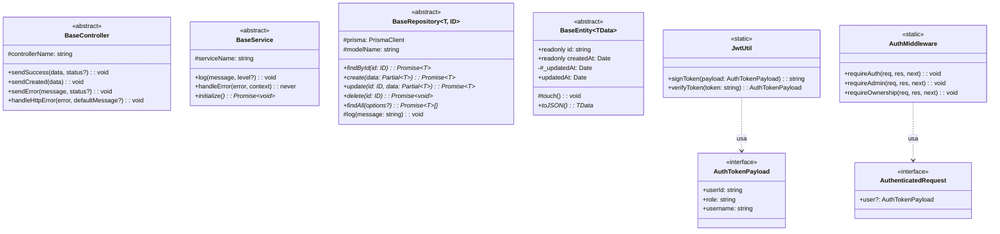
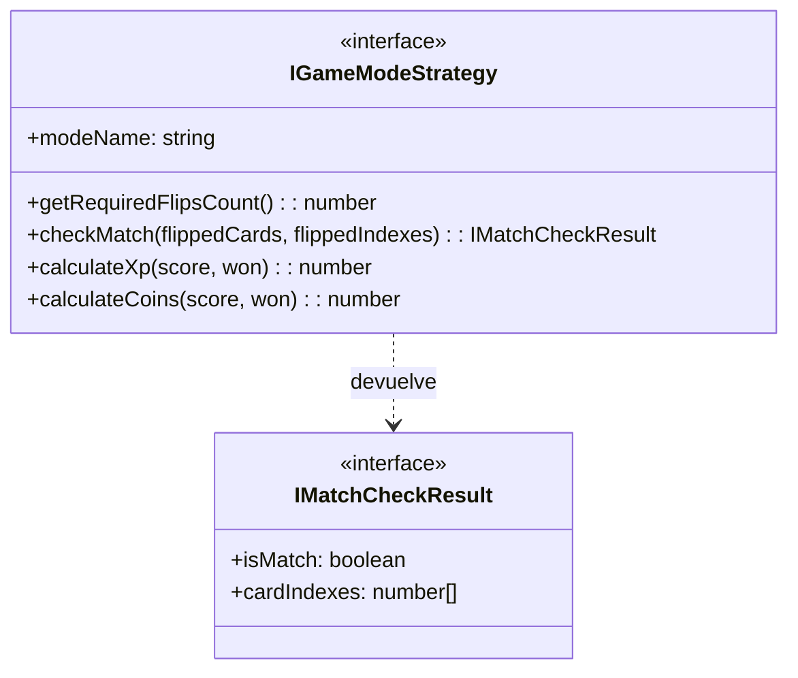
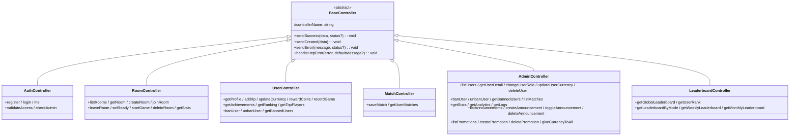
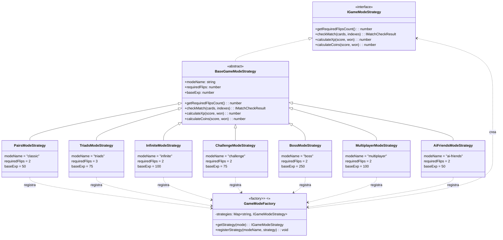
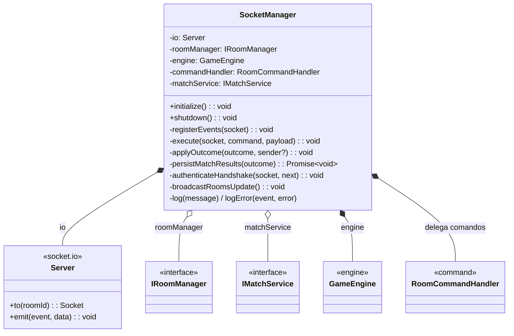
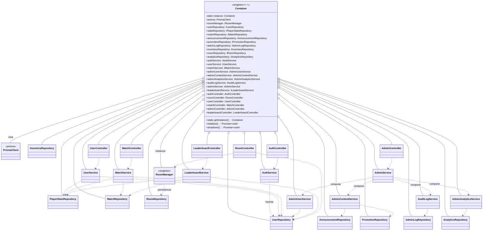
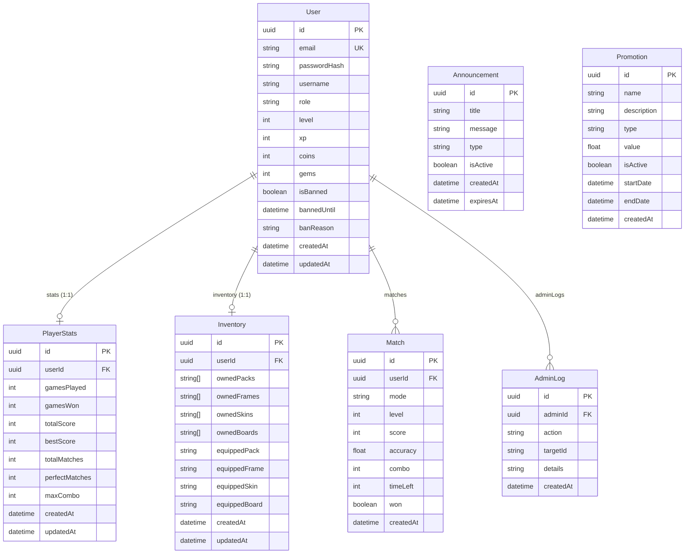

# 📐 Diagramas de Clase — Memorize

Colección completa de diagramas de clase UML del proyecto, generados con **Mermaid**.

> 📌 **Cómo verlos renderizados:**
> - **GitHub / GitLab**: los bloques ` ```mermaid ` se renderizan automáticamente.
> - **VS Code**: extensión *Markdown Preview Mermaid Support* o la vista previa integrada con *Mermaid*.
> - **Local**: `npx @mermaid-js/mermaid-cli mmdc -i DIAGRAMAS_DE_CLASE.md` para exportar a SVG/PNG.

> 📄 **Diagramas UML en PlantUML:** además de este documento, el diagrama de arquitectura
> (`frontend/arquitectura-backend.puml` → `.png` / `.html`) y el diagrama de clases del módulo
> Multijugador + Motor (`frontend/diagrama-clases.puml` → `.png` / `.html`) están versionados y
> renderizados con PlantUML.

---

## 📚 Índice de diagramas

| # | Diagrama | Sección |
|---|----------|---------|
| 1 | Vista general por capas | [Paquetes y capas](#1-paquetes-y-capas) |
| 2 | Clases base del núcleo | [Core (clases base)](#2-core-clases-base) |
| 3 | Interfaces de repositorios | [Interfaces de repositorios](#3-interfaces-de-repositorios) |
| 4 | Interfaces de servicios y salas | [Interfaces de servicios](#4-interfaces-de-servicios) |
| 5 | Interfaz del patrón de modos | [Interfaz de modos de juego](#5-interfaz-de-modos-de-juego) |
| 6 | Repositorios (capa de datos) | [Repositorios](#6-repositorios) |
| 7 | Servicios (lógica de negocio) | [Servicios](#7-servicios) |
| 8 | Controladores (capa HTTP) | [Controladores](#8-controladores) |
| 9 | Modelos de dominio | [Modelos de dominio](#9-modelos-de-dominio) |
| 10 | Patrón Strategy + Factory | [Estrategias de modo de juego](#10-estrategias-de-modo-de-juego) |
| 11 | Módulo multijugador (salas) | [Salas multijugador](#11-salas-multijugador) |
| 12 | Escena Socket.IO | [SocketManager](#12-socketmanager) |
| 13 | Grafo de dependencias (Container) | [Container (DI/IoC)](#13-container-di-ioc) |
| 14 | Frontend: clases y tipos | [Frontend](#14-frontend-clases-y-tipos) |
| 15 | Modelo de datos (base de datos) | [Modelo de datos Prisma (ER)](#15-modelo-de-datos-prisma-er) |

> **Leyenda UML (Mermaid):**
> `A <|-- B` = B hereda de A · `A <|.. B` = B implementa a A · `A *-- B` = composición · `A o-- B` = agregación · `A ..> B` = dependencia/uso · `..>` con flecha = dependencia.

---

## 1. Paquetes y capas

Vista de alto nivel de la arquitectura en capas del backend. Cada bloque representa un paquete
(directorio) y las flechas indican la dirección de las dependencias.

```mermaid
classDiagram
    namespace Core {
        class BaseController
        class BaseRepository
        class BaseService
        class BaseEntity
        class AuthMiddleware
        class JwtUtil
    }
    namespace Interfaces {
        class IRepository
        class IServices
        class IGameModeStrategy
    }
    namespace Repositories {
        class UserRepository
        class PlayerStatsRepository
        class MatchRepository
        class AnnouncementRepository
        class PromotionRepository
        class AdminLogRepository
        class RoomRepository
        class InventoryRepository
        class AnalyticsRepository
    }
    namespace Services {
        class AuthService
        class UserService
        class MatchService
        class AdminService
        class AdminUserService
        class AdminContentService
        class AdminAnalyticsService
        class AuditLogService
        class LeaderboardService
    }
    namespace Engine {
        class RoomCommandHandler
        class GameEngine
        class TurnTimer
        class DeckGenerator
    }
    namespace Controllers {
        class AuthController
        class RoomController
        class UserController
        class MatchController
        class AdminController
        class LeaderboardController
    }
    namespace Models {
        class User
        class PlayerStats
        class Match
        class GameRoom
        class Player
        class GameModeFactory
        class GameModeStrategy
    }
    namespace Managers {
        class RoomManager
    }
    namespace Socket {
        class SocketManager
    }
    namespace Container {
        class Container
    }

    Repositories ..> Core   : extienden
    Services ..> Core       : extienden
    Controllers ..> Core    : extienden
    Models ..> Core         : extienden
    Services ..> Interfaces : implementan
    Repositories ..> Interfaces : implementan
    Managers ..> Interfaces : implementan
    Models ..> Interfaces   : implementan
    Controllers ..> Services   : usan
    Services ..> Repositories : inyectan
    Controllers ..> Managers : usan
    Socket ..> Engine      : delega comandos
    Engine ..> Managers    : muta salas
    Engine ..> Models      : opera dominio
    Engine ..> Interfaces  : usa
    Container ..> Repositories : crea
    Container ..> Services    : crea
    Container ..> Controllers : crea
    Container ..> Managers  : usa
    Container ..> Engine    : crea
    Container ..> Socket    : cablea
```

---

## 2. Core (clases base)

Clases abstractas base y utilidades transversales del núcleo. Todas las capas heredan de ellas
(Template Method + Abstracción).



---

## 3. Interfaces de repositorios

Contratos del patrón **Repository** (Principio de Segregación de Interfaces). Las interfaces
granulares `IReadRepository` / `IWriteRepository` se combinan en `ICrudRepository`.

```mermaid
classDiagram
    class IReadRepository~T, ID~ {
        <<interface>>
        +findById(id: ID): Promise~T~
        +findAll(options?): Promise~T~[]
    }
    class IWriteRepository~T, ID~ {
        <<interface>>
        +create(data: Partial~T~): Promise~T~
        +update(id: ID, data: Partial~T~): Promise~T~
        +delete(id: ID): Promise~void~
    }
    class ICrudRepository~T, ID~ {
        <<interface>>
    }
    class IUserRepository {
        <<interface>>
        +findByEmail(email): Promise~User~
        +findBannedUsers(): Promise~User~[]
        +updateLastLogin(id): Promise~void~
        +findWithFilters(filters): Paginado
        +findDetail(id): Promise~any~
        +findTopByField(field, limit): Promise~any[]~
        +countAbove(field, value): Promise~number~
    }
    class IPlayerStatsRepository {
        <<interface>>
        +findByUserId(userId): Promise~PlayerStats~
        +getTopPlayers(criteria, limit?): Promise~PlayerStats~[]
        +upsert(userId, data): Promise~PlayerStats~
        +countAbove(field, value): Promise~number~
    }
    class IMatchRepository {
        <<interface>>
        +count(where?): Promise~number~
        +getBestScoresByMode(mode, limit?): Promise~Match~[]
        +findByDateRange(start, end): Promise~Match~[]
    }
    class IAnnouncementRepository {
        <<interface>>
        +toggleActive(id, isActive): Promise~any~
    }
    class IPromotionRepository {
        <<interface>>
    }
    class IRoomRepository {
        <<interface>>
        +save(room): Promise~void~
        +saveFinal(room, winnerId): Promise~void~
        +delete(roomId): Promise~void~
        +findByCodeOrId(search): Promise~GameRoom~
        +findActiveRooms(): Promise~GameRoom[]~
    }
    class IInventoryRepository {
        <<interface>>
        +findByUserId(userId): Promise~IInventoryData~
        +ensure(userId): Promise~IInventoryData~
        +updateEquipped(userId, equipment): Promise~IInventoryData~
    }
    class IAnalyticsRepository {
        <<interface>>
        +getOverview(): { overview, matchesByMode, topPlayers }
        +getWindowMetrics(start, end): IAnalyticsWindow
        +giveCurrencyToAll(coins?, gems?): Promise~number~
    }
    class IAdminLogRepository {
        <<interface>>
        +createLog(data): Promise~any~
        +findAll(filters): Promise~Paginado~
    }

    IReadRepository <|-- ICrudRepository
    IWriteRepository <|-- ICrudRepository
    ICrudRepository <|-- IUserRepository
    ICrudRepository <|-- IPlayerStatsRepository
    ICrudRepository <|-- IMatchRepository
    ICrudRepository <|-- IAnnouncementRepository
    ICrudRepository <|-- IPromotionRepository
```

> `IAdminLogRepository`, `IInventoryRepository` y `IRoomRepository` **no** extienden
> `ICrudRepository`: exponen solo los métodos que necesitan (ISP).

---

## 4. Interfaces de servicios

Contratos de la capa de servicios e `IRoomManager` (que gobierna las salas multijugador).

```mermaid
classDiagram
    class IAuthService {
        <<interface>>
        +initialize(): Promise~void~
        +register(email, password, username?): Promise~User~
        +login(email, password): { user, token }
        +validateAccess(userId): Promise~boolean~
        +isAdmin(userId): Promise~boolean~
    }
    class IUserService {
        <<interface>>
        +initialize(): Promise~void~
        +getUserProfile(userId): { user, stats }
        +getProgress(userId): Promise~IPlayerProgress~
        +equipItem(userId, kind, id): Promise~IPlayerProgress~
        +addXpToUser(userId, xp): { user, levelsGained }
        +updateCurrency(userId, coins?, gems?): Promise~User~
        +rewardCoins(userId, amount): Promise~User~
        +recordGamePlayed(userId, data): { user, stats, levelsGained }
        +getUserAchievements(userId): Promise~string~[]
        +getPlayerRanking(userId): { rank, totalPlayers, percentile }
        +banUser(userId, reason, duration?): Promise~User~
        +unbanUser(userId): Promise~User~
        +getBannedUsers(): Promise~User~[]
        +getTopPlayers(limit?): Array
    }
    class IPlayerProgress {
        <<interface>>
        +xp / level / rankId / gamesPlayed / gamesWon
        +totalScore / highestCombo / bossesDefeated
        +unlockedSkins / unlockedEffects / unlockedPowers
        +equippedSkin / equippedEffect / equippedPower / equippedPack
        +coins / gems
    }
    class IMatchService {
        <<interface>>
        +initialize(): Promise~void~
        +saveMatch(data): { match, xpEarned, coinsEarned, user }
        +getUserMatches(userId, filters): { matches, total }
        +getAllMatches(filters): { matches, total }
        +getBestScoresByMode(mode, limit?): Promise~Match~[]
        +getMatchesByDateRange(start, end): Promise~Match~[]
    }
    class IAdminService {
        <<interface>>
        +initialize(): Promise~void~
        +verifyAdmin(adminId): Promise~boolean~
        +listUsers(filters): { users, total, totalPages }
        +getUserDetail(userId): Promise~any~
        +changeUserRole(userId, role, adminId): Promise~User~
        +updateUserCurrency(userId, coins?, gems?, adminId): Promise~User~
        +deleteUser(userId, adminId): Promise~void~
        +banUser(userId, reason, durationMinutes?, adminId): Promise~User~
        +unbanUser(userId, adminId): Promise~User~
        +getBannedUsers(): Promise~User~[]
        +getGeneralStats(): Promise~any~
        +getAnalytics(period): Promise~any~
        +listAnnouncements() / createAnnouncement(data) / toggleAnnouncement(id, active) / deleteAnnouncement(id)
        +listPromotions() / createPromotion(data) / deletePromotion(id)
        +giveCurrencyToAll(coins?, gems?, adminId): { affectedUsers }
        +getLogs(filters): { logs, total, totalPages }
    }
    class IAdminUserService {
        <<interface>>
        +initialize(): Promise~void~
        +verifyAdmin(adminId): Promise~boolean~
        +listUsers(filters): Paginado
        +getUserDetail(userId): Promise~any~
        +changeUserRole(userId, role, adminId): Promise~User~
        +updateUserCurrency(userId, coins?, gems?, adminId): Promise~User~
        +deleteUser(userId, adminId): Promise~void~
        +banUser(userId, reason, durationMinutes?, adminId): Promise~User~
        +unbanUser(userId, adminId): Promise~User~
        +getBannedUsers(): Promise~User~[]
    }
    class IAdminContentService {
        <<interface>>
        +initialize(): Promise~void~
        +listAnnouncements() / createAnnouncement(data)
        +toggleAnnouncement(id, active) / deleteAnnouncement(id)
        +listPromotions() / createPromotion(data) / deletePromotion(id)
    }
    class IAdminAnalyticsService {
        <<interface>>
        +initialize(): Promise~void~
        +getAllMatches(filters): Paginado
        +getGeneralStats(): Promise~any~
        +getAnalytics(period): Promise~any~
        +giveCurrencyToAll(coins?, gems?, adminId): { affectedUsers }
    }
    class IAuditLogService {
        <<interface>>
        +initialize(): Promise~void~
        +getLogs(filters): { logs, total, totalPages }
    }
    class ILeaderboardService {
        <<interface>>
        +initialize(): Promise~void~
        +getGlobalLeaderboard(type?, limit?): { leaderboard, total }
        +getUserRank(userId, type?): { rank, value, userId, username }
        +getLeaderboardByMode(mode, limit?): { leaderboard, mode }
        +getWeeklyLeaderboard(limit?): Promise~any~
        +getMonthlyLeaderboard(limit?): Promise~any~
    }
    class IRoomManager {
        <<interface>>
        +createRoom(data): GameRoom
        +getRoom(roomIdOrCode): GameRoom
        +hasRoom(roomIdOrCode): boolean
        +deleteRoom(roomId): boolean
        +getAvailableRooms(filters?): GameRoom[]
        +joinRoom(roomId, playerData, password?): GameRoom
        +leaveRoom(roomId, playerId): void
        +getStats(): { totalRooms, waitingRooms, playingRooms, totalPlayers }
        +persistRoom(room): Promise~void~
        +persistFinal(room, winnerId): Promise~void~
        +recoverActiveRooms(): Promise~void~
    }
```

---

## 5. Interfaz de modos de juego

Contrato del patrón **Strategy** que define las reglas recompensas de cada modo de juego.



---

## 6. Repositorios

Implementaciones concretas del patrón **Repository**. Heredan de `BaseRepository` y mapean
filas de Prisma a modelos de dominio (`toDomain`).

```mermaid
classDiagram
    class BaseRepository~T, ID~ {
        <<abstract>>
        #prisma: PrismaClient
        #modelName: string
        +findById(id)*
        +create(data)*
        +update(id, data)*
        +delete(id)*
        +findAll(options?)*
        #log(message)
    }

    class UserRepository {
        +findById(id): User
        +findByEmail(email): User
        +create(data & passwordHash): User
        +update(id, data & passwordHash): User
        +delete(id): void
        +findAll(options): User[]
        +findBannedUsers(): User[]
        +updateLastLogin(id): void
        -toDomain(prismaUser): User
    }
    class PlayerStatsRepository {
        +findById(id): PlayerStats
        +findByUserId(userId): PlayerStats
        +create(data): PlayerStats
        +update(id, data): PlayerStats
        +delete(id): void
        +findAll(options): PlayerStats[]
        +getTopPlayers(criteria, limit): PlayerStats[]
        +upsert(userId, data): PlayerStats
    }
    class MatchRepository {
        +findById(id): Match
        +create(data): Match
        +update(id, data): Match
        +delete(id): void
        +findAll(options): Match[]
        +count(where?): number
        +getBestScoresByMode(mode, limit): Match[]
        +findByDateRange(start, end): Match[]
    }
    class AnnouncementRepository {
        +findById(id): Announcement
        +create(data): Announcement
        +update(id, data): Announcement
        +delete(id): void
        +findAll(options): Announcement[]
        +toggleActive(id, isActive): Announcement
    }
    class PromotionRepository {
        +findById(id): Promotion
        +create(data): Promotion
        +update(id, data): Promotion
        +delete(id): void
        +findAll(): Promotion[]
    }
    class AdminLogRepository {
        -prisma: PrismaClient
        +createLog(data): AdminLog
        +findAll(filters): { logs, total, totalPages }
    }
    class RoomRepository {
        +save(room): void
        +saveFinal(room, winnerId): void
        +delete(roomId): void
        +findByCodeOrId(search): GameRoom
        +findActiveRooms(): GameRoom[]
        -toDomain(row): GameRoom
    }
    class InventoryRepository {
        -prisma: PrismaClient
        +findByUserId(userId): IInventoryData
        +ensure(userId): IInventoryData
        +updateEquipped(userId, equipment): IInventoryData
    }
    class AnalyticsRepository {
        -prisma: PrismaClient
        +getOverview(): { overview, matchesByMode, topPlayers }
        +getWindowMetrics(start, end): IAnalyticsWindow
        +giveCurrencyToAll(coins?, gems?): number
    }
    class IAdminLogRepository {
        <<interface>>
    }
    class IInventoryRepository {
        <<interface>>
    }
    class IRoomRepository {
        <<interface>>
    }
    class IAnalyticsRepository {
        <<interface>>
    }

    BaseRepository <|-- UserRepository
    BaseRepository <|-- PlayerStatsRepository
    BaseRepository <|-- MatchRepository
    BaseRepository <|-- AnnouncementRepository
    BaseRepository <|-- PromotionRepository
    BaseRepository <|-- RoomRepository
    AdminLogRepository ..|> IAdminLogRepository
    InventoryRepository ..|> IInventoryRepository
    RoomRepository ..|> IRoomRepository
    AnalyticsRepository ..|> IAnalyticsRepository
```

> `AdminLogRepository`, `InventoryRepository` y `RoomRepository` **no** heredan de
> `BaseRepository`: implementan directamente su interfaz (ISP), ya que no necesitan el CRUD
> genérico. `AnalyticsRepository` tampoco lo hereda: es la única puerta Prisma de la analítica.

---

## 7. Servicios

Lógica de negocio. Todos heredan de `BaseService` e implementan su contrato de interfaz.
Reciben los repositorios por **inyección de dependencias**.

```mermaid
classDiagram
    class BaseService {
        <<abstract>>
        #serviceName: string
        +log(message, level?): void
        +handleError(error, context): never
        +initialize(): Promise~void~*
    }

    class AuthService {
        +initialize(): Promise~void~
        +register(email, password, username?): Promise~User~
        +login(email, password): { user, token }
        +validateAccess(userId): Promise~boolean~
        +isAdmin(userId): Promise~boolean~
    }
    class UserService {
        +initialize(): Promise~void~
        +getUserProfile(userId): { user, stats }
        +addXpToUser(userId, xp): { user, levelsGained }
        +updateCurrency(userId, coins?, gems?): Promise~User~
        +rewardCoins(userId, amount): Promise~User~
        +recordGamePlayed(userId, data): { user, stats, levelsGained }
        +getUserAchievements(userId): Promise~string~[]
        +getPlayerRanking(userId): { rank, totalPlayers, percentile }
        +banUser(userId, reason, duration?): Promise~User~
        +unbanUser(userId): Promise~User~
        +getBannedUsers(): Promise~User~[]
        +getTopPlayers(limit?): Array
    }
    class MatchService {
        +initialize(): Promise~void~
        +saveMatch(data): { match, xpEarned, coinsEarned, user }
        +getUserMatches(userId, filters): { matches, total }
        +getAllMatches(filters): { matches, total }
        +getBestScoresByMode(mode, limit?): Promise~Match~[]
        +getMatchesByDateRange(start, end): Promise~Match~[]
    }
    class AdminService {
        <<facade>>
        -adminUserService: IAdminUserService
        -adminContentService: IAdminContentService
        -adminAnalyticsService: IAdminAnalyticsService
        -auditLogService: IAuditLogService
        +initialize(): Promise~void~
        +verifyAdmin / listUsers / getUserDetail / changeUserRole
        +updateUserCurrency / deleteUser / banUser / unbanUser
        +getBannedUsers / getAllMatches / getGeneralStats / getAnalytics
        +listAnnouncements / createAnnouncement / toggleAnnouncement
        +deleteAnnouncement / listPromotions / createPromotion
        +deletePromotion / giveCurrencyToAll / getLogs
        ' Solo compone y delega (SRP); antes tenía 550+ líneas.
    }
    class AdminUserService {
        +initialize / verifyAdmin / listUsers / getUserDetail
        +changeUserRole / updateUserCurrency / deleteUser
        +banUser / unbanUser / getBannedUsers
    }
    class AdminContentService {
        +initialize / listAnnouncements / createAnnouncement
        +toggleAnnouncement / deleteAnnouncement
        +listPromotions / createPromotion / deletePromotion
    }
    class AdminAnalyticsService {
        +initialize / getAllMatches / getGeneralStats
        +getAnalytics / giveCurrencyToAll
    }
    class AuditLogService {
        +initialize / getLogs
    }
    class LeaderboardService {
        +initialize(): Promise~void~
        +getGlobalLeaderboard(type?, limit?): { leaderboard, total }
        +getUserRank(userId, type?): { rank, value, userId, username }
        +getLeaderboardByMode(mode, limit?): { leaderboard, mode }
        +getWeeklyLeaderboard(limit?) / getMonthlyLeaderboard(limit?)
        -buildPeriodLeaderboard(start, end, period, limit)
    }

    BaseService <|-- AuthService
    BaseService <|-- UserService
    BaseService <|-- MatchService
    BaseService <|-- AdminService
    BaseService <|-- AdminUserService
    BaseService <|-- AdminContentService
    BaseService <|-- AdminAnalyticsService
    BaseService <|-- AuditLogService
    BaseService <|-- LeaderboardService

    AdminService ..> IAdminUserService : delega
    AdminService ..> IAdminContentService : delega
    AdminService ..> IAdminAnalyticsService : delega
    AdminService ..> IAuditLogService : delega
```

> **Refactor SRP (Fase 8):** `AdminService` dejó de ser una clase de ~550 líneas con acceso directo
> a `PrismaClient` y pasó a ser una **fachada** que compone cuatro servicios cohesivos, cada uno
> dependiente de interfaces de repositorio (DIP).

---

## 8. Controladores

Capa de presentación HTTP. Heredan de `BaseController` para respuestas/errores uniformes.
Cada controlador usa **interfaces** de servicio (DIP).



---

## 9. Modelos de dominio

Entidades de negocio con comportamiento. Heredan de `BaseEntity` (todas menos `Player`,
que solo implementa `IPlayer`). Los métodos de negocio viven en el propio modelo.

```mermaid
classDiagram
    class BaseEntity~TData~ {
        <<abstract>>
        +readonly id: string
        +readonly createdAt: Date
        +updatedAt: Date
        #touch(): void
        +toJSON(): TData*
    }

    class User {
        +readonly email: string
        #-_username / _role / _level / _xp / _coins / _gems
        #-_isBanned / _bannedUntil / _banReason / _passwordHash
        +hasPassword(): boolean
        +isCurrentlyBanned(): boolean
        +applyBan(reason, durationMinutes?): void
        +removeBan(): void
        +getXpForNextLevel(): number
        +canLevelUp(): boolean
        +levelUp(): void
        +addXp(amount): number
        +addCoins(amount) / addGems(amount)
        +canAfford(coins, gems): boolean
        +purchase(coins, gems): void
        +setCurrency(coins?, gems?): void
        +isAdmin(): boolean
        +toJSON(): IUser
    }
    class PlayerStats {
        +readonly userId: string
        +getWinRate(): number
        +getAverageScore(): number
        +getPerfectMatchRate(): number
        +recordGame(score, won, matches, perfect, combo): void
        +getSkillLevel(): 'Novice' .. 'Master'
        +checkAchievements(): string[]
        +toJSON(): IPlayerStats
    }
    class Match {
        +readonly userId: string
        +readonly mode / level / score / accuracy / combo / timeLeft / won
        +calculateXpEarned(): number
        +calculateCoinsEarned(): number
        +toJSON(): IMatch
    }
    class Player {
        +readonly id: string
        +socketId / name / level: get
        +isReady: get
        +score / matches: get+set
        +isConnected: get
        +setReady(ready): void
        +addScore(points): void
        +addMatch(): void
        +resetGameStats(): void
        +disconnect() / reconnect(newSocketId): void
        +toJSON(): IPlayer
    }
    class GameRoom {
        +readonly code: string
        +name / hostId / hostName / maxPlayers: get
        +mode: get+set
        +cardCount / difficulty / isPrivate / password: get
        -players: Map~string, Player~
        -gameState: IGameState
        +addPlayer(playerData) / removePlayer(playerId) / getPlayer / hasPlayer
        +getPlayers / getPlayerCount / isFull / isEmpty
        +setPlayerReady(playerId, ready) / areAllPlayersReady()
        +startGame(cards, bypassReadyCheck?): void
        +getRequiredFlipsCount(): number
        +flipCard(playerId, cardIndex): void
        +checkMatch(): { isMatch, cardIndexes }
        +registerMatch(playerId, indexes) / clearFlippedCards()
        +nextTurn(): string
        +isGameFinished(): boolean / finishGame(): string
        +disconnectPlayer / reconnectPlayer / validatePassword
        +toJSON()
    }
    class IPlayer {
        <<interface>>
        +id / socketId / name / level / isReady / score / matches / isConnected
    }
    class IGameState {
        <<interface>>
        +status / currentRound / totalRounds / cards / flippedCards / matchedCards / currentTurn / scores
    }
    class GameStatus {
        <<enumeration>>
        WAITING
        PLAYING
        FINISHED
    }

    BaseEntity <|-- User
    BaseEntity <|-- PlayerStats
    BaseEntity <|-- Match
    BaseEntity <|-- GameRoom
    IPlayer <|.. Player

    GameRoom o-- Player : players
    GameRoom *-- IGameState : gameState
    GameRoom ..> GameStatus : usa
    Match ..> GameModeFactory : usa
    GameRoom ..> GameModeFactory : usa
```

---

## 10. Estrategias de modo de juego

Patrón **Strategy + Factory**: cada modo concreta las reglas polimórficamente sin modificar
`GameRoom` ni `Match` (OCP).



---

## 11. Salas multijugador

`RoomManager` (Singleton) gestiona las salas en memoria. Compone un mapa de `GameRoom`,
y cada `GameRoom` compone un mapa de `Player`.

```mermaid
classDiagram
    class IRoomManager {
        <<interface>>
        +createRoom(data): GameRoom
        +getRoom(roomIdOrCode): GameRoom
        +hasRoom(roomIdOrCode): boolean
        +deleteRoom(roomId): boolean
        +getAvailableRooms(filters?): GameRoom[]
        +joinRoom(roomId, playerData, password?): GameRoom
        +leaveRoom(roomId, playerId): void
        +getStats(): Object
    }
    class RoomManager {
        <<singleton>>
        -static instance: RoomManager
        -rooms: Map~string, GameRoom~
        -repo?: IRoomRepository
        +static getInstance(repo?): RoomManager
        +createRoom(data): GameRoom
        +getRoom(roomIdOrCode): GameRoom
        +hasRoom / deleteRoom(roomId): boolean
        +getAvailableRooms(filters?): GameRoom[]
        +joinRoom(roomId, playerData, password?): GameRoom
        +leaveRoom(roomId, playerId): void
        +getStats(): Object
        +persistRoom(room): Promise~void~
        +persistFinal(room, winnerId): Promise~void~
        +recoverActiveRooms(): Promise~void~
        -cleanupOldRooms(): void
        -startCleanupTask(): void
        -generateRoomId(): string
    }
    class GameRoom {
        -players: Map~string, Player~
        -gameState: IGameState
        +addPlayer / removePlayer / getPlayer / hasPlayer
        +startGame(cards, bypassReadyCheck?)
        +flipCard(playerId, cardIndex)
        +checkMatch(): { isMatch, cardIndexes }
    }
    class Player {
        +setReady(ready) / addScore(points) / addMatch()
        +disconnect() / reconnect(socketId)
    }
    class IRoomRepository {
        <<interface>>
    }

    RoomManager ..|> IRoomManager
    RoomManager *-- GameRoom : rooms (Map)
    GameRoom *-- Player : players (Map)
    RoomManager ..> IRoomRepository : persiste via interfaz (DIP)
```

---

## 12. SocketManager (transporte delgado)

Capa de tiempo real. **Ya no contiene reglas de juego**: autentica el *handshake* con JWT,
escucha los comandos del cliente y los entrega a `RoomCommandHandler`, que devuelve un
`CommandOutcome`. `SocketManager` solo aplica ese resultado (emitir/broadcast, entrar o salir
de salas, persistir, refrescar la lista). No tiene `socketRooms` ni `checkMatch`: la identidad
sale de `socket.data`.



**Protocolo de socket (comandos entrantes):**

| Comando | Qué hace |
|---------|----------|
| `join` · `leave` · `ready` · `start` | Ciclo de vida de la sala (el host inicia) |
| `flip` | Solicita voltear una carta (validado por el motor) |
| `emote` · `rematch` · `chat` | Interacción social |
| `reconnect` · `disconnect` | Reconexión y limpieza de presencia |

**Eventos que emite el servidor:**

| Grupo | Eventos |
|-------|---------|
| Sala | `room:joined`, `room:state`, `room:player-joined`, `room:player-left`, `room:player-ready`, `room:player-disconnected`, `room:player-reconnected`, `room:host-changed`, `room:error` |
| Juego | `game:started`, `game:card-flipped`, `game:match-found`, `game:no-match`, `game:turn-changed`, `game:turn-expired`, `game:finished`, `game:emote-received`, `game:rematch-requested`, `game:error` |
| Chat / Sistema | `chat:message`, `chat:error`, `rooms:update` |

> Se eliminaron los eventos delegados al cliente (`game:update-score`, `game:pass-turn`): el
> servidor es la única fuente de verdad y posee el reloj de turno.

---

## 13. Container (DI/IoC)

`Container` es el ensamblador central (Singleton + **Dependency Injection**). Compone prisma,
managers, repositorios, servicios y controladores respetando la dirección de las flechas.



> El grafo completo de dependencias que ensambla `Container` (constructor):
> ```
> PrismaClient ─► 9 Repositorios ─► 9 Servicios ─► 6 Controladores
> RoomManager (getInstance) ─► RoomController · SocketManager
> SocketManager ─► RoomCommandHandler ─► GameEngine / RoomManager
> ```
> Ningún servicio importa `PrismaClient`: `AdminService` y `LeaderboardService` ya dependen
> solo de interfaces de repositorio (DIP).

---

## 14. Frontend: clases y tipos

Solo hay tres clases reales en el frontend (`ApiError`, `SoundSystem`, `ErrorBoundary`).
El resto son contratos de tipos (`interface`) que se sincronizan manualmente con las respuestas
HTTP y eventos de socket del backend.

```mermaid
classDiagram
    class Error {
        <<builtin>>
    }
    class Component {
        <<react>>
    }
    class ApiError {
        +status: number
        +constructor(message: string, status: number)
    }
    class SoundSystem {
        <<singleton>>
        -ctx: AudioContext
        -muted: boolean
        -masterGain: GainNode
        +toggleMute(): boolean
        +isMuted(): boolean
        +playCardFlip() / playMatchSound(combo?)
        +playTriadStep(step) / playComboBreak()
        +playBombExplosion() / playFreezeSound() / playGlitchSound()
        +playBossAttack() / playVictoryFanfare()
        +playLevelUp() / playPowerUp() / playBombExplode()
    }
    class ErrorBoundary {
        #state: { hasError }
        +getDerivedStateFromError(error)
        +render()
    }

    Error <|-- ApiError
    Component <|-- ErrorBoundary
```

**Tipos representativos del frontend** (definidos en `src/App.tsx` y `src/lib/`):

```mermaid
classDiagram
    class Universe {
        <<type>>
        volcania | frostheim | neural | verdalis | lunaris
    }
    class BossType {
        <<type>>
        naturaleza | ciencia | humano | ecosistema | tecnologia
    }
    class GameScreen {
        <<type>>
        login | register | lobby | roomWaiting | multiplayerGame
        finalResults | game | boss | boss-select | reward
        classic | classicLevelSelect | loading | infinite | challenge
        ai-friends | ai-room-lobby | ai-room-waiting
        profile | ranked | tienda | collection | admin
    }
    class Player {
        <<interface>>
        +id: string
        +email: string
        +username? / role? / level? / xp? / coins? / gems?
    }
    class Room {
        <<interface>>
        +id / name / code / hostId / hostName
        +players: Player[]
        +maxPlayers / currentPlayers
        +status / isStarted
        +gameMode?: classic | connections | triads
        +cardCount? / difficulty? / isPrivate?
    }
    class GameState {
        <<interface>>
        +status / currentRound / totalRounds
        +flippedCards / matchedCards / currentTurn / scores
    }
    class CardItem {
        <<interface>>
        +id: number
        +groupId: number
        +symbol / name / lore
        +isFlipped / isMatched
        +orderInTriad?
    }
    class EquippedItems {
        <<interface>>
        +pack / frame / skin / board
    }
    class Quest {
        <<interface>>
        +id / title / description / progress / maxProgress
        +rewardCoins / rewardXP / isCompleted / isClaimed
    }
    class CollectionItem {
        <<interface>>
        +id / title / category / symbol / lore / isUnlocked / unlockedAt?
    }

    Room o-- Player : players
```



> El estado del frontend ya no vive en los componentes: está centralizado en stores de Zustand
> (`authStore`, `roomStore`, `inventoryStore`). `roomStore` refleja el estado autoritativo que
> llega por socket a través de `socketBus` (puente de eventos) y `multiplayerProtocol` (tipos y
> nombres de eventos). Los componentes React son funcionales (hooks), no clases.
>
> ⚠️ **Nota de sincronización**: los tipos del frontend se mantienen a mano contra las respuestas
> HTTP y los eventos de socket del backend. No hay paquete `shared/` compartido.

---

## 15. Modelo de datos Prisma (ER)

Diagrama entidad-relación de la base de datos PostgreSQL según `backend/prisma/schema.prisma`.



**Relaciones clave:** `User ↔ PlayerStats` (1:1) · `User ↔ Inventory` (1:1) · `User → Match`
(1:N, cascade) · `User (admin) → AdminLog` (1:N). `Announcement` y `Promotion` no tienen relaciones.

---

## 🏁 Resumen de patrones representados

| Patrón | Clases |
|--------|--------|
| **Singleton** | `Container`, `RoomManager`, `GameModeFactory` (estático), `SoundSystem` |
| **Factory / OCP** | `GameModeFactory` → estrategias registradas por nombre de modo |
| **Strategy** | `IGameModeStrategy` → `BaseGameModeStrategy` → 7 modos; consumido por `Match` y `GameRoom` |
| **Repository** | `BaseRepository` + interfaces `I*Repository` → 6 repositorios |
| **Template Method** | métodos abstractos de `BaseRepository`, `BaseService` |
| **DI / IoC (DIP)** | `Container` inyecta interfaces en repositorios, servicios y controladores |
| **Middleware chain** | `requireAuth` / `requireAdmin` / `requireOwnership` + JWT |